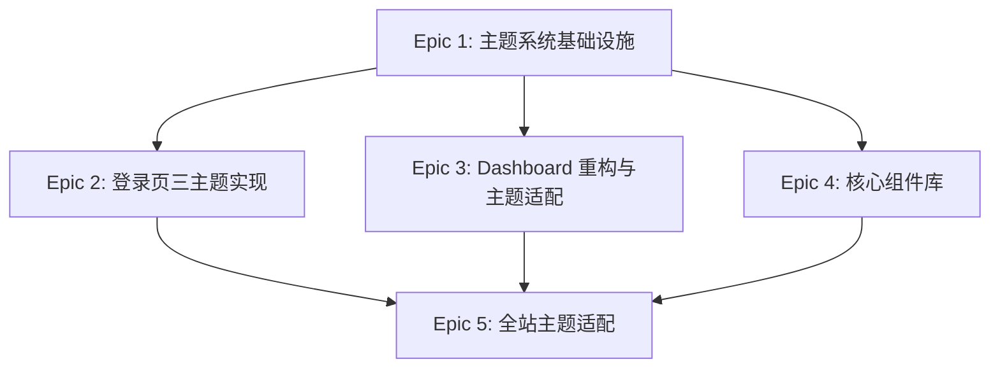

# Epic Breakdown: 多主题系统实现

**Project:** teaching-manage
**Created:** 2026-02-25
**Based On:**
- `_bmad-output/planning-artifacts/ux-design-specification.md`
- `UI/teaching-manage-prototypes.pen`

---

## 概述

本文档定义了教学管理系统多主题功能的实现 Epic。系统将支持三种视觉主题：中国红（Chinese Red）、科技蓝（Tech Blue，默认）、自然绿（Nature Green），用户可在登录页面或系统设置中切换。

**总体目标：**
- 实现三主题无缝切换
- 保持视觉一致性
- 提升用户体验和个性化

**时间预估：** 5-6 周
**总 Story Points：** 55

---

## Epic 1: 主题系统基础设施

**描述：** 建立多主题系统的技术基础，包括 CSS 变量定义、主题切换逻辑、持久化策略和后端 API 支持。

**优先级：** P0
**Story Points：** 13
**预估时间：** 1.5 周
**状态：** 已完成
**实际完成时间：** 2026-02-25

### User Stories

#### US1.1: 主题定义和变量系统
```
作为开发者
我希望有完整的 CSS 变量定义
以便所有组件可以基于主题变量开发

验收标准：
- 三主题色彩规范完整定义
- CSS Variables 覆盖所有设计 Token
- Element Plus 变量覆盖配置完成
```

#### US1.2: 主题切换功能
```
作为用户
我希望能够在三种主题间切换
以便选择我喜欢的视觉风格

验收标准：
- 点击主题色块即时切换，无页面刷新
- 切换过程有 250ms 平滑过渡
- 当前主题带 ✓ 标记高亮显示
```

#### US1.3: 主题偏好持久化
```
作为用户
我希望我的主题选择被记住
以便下次登录时自动应用

验收标准：
- localStorage 正确保存主题选择
- 已登录用户主题同步到服务器
- 主题加载优先级：用户配置 > localStorage > 默认值
```

### Tasks

#### Task 1.1: 创建 CSS 变量文件
- **描述：** 创建主题相关的 CSS 文件结构
- **文件：**
  - `frontend/src/styles/themes/variables.css` - 通用设计 Token
  - `frontend/src/styles/themes/theme-chinese-red.css`
  - `frontend/src/styles/themes/theme-tech-blue.css`
  - `frontend/src/styles/themes/theme-nature-green.css`
- **估时：** 4h
- **优先级：** P0
- **依赖：** 无
- **验收：** 所有 CSS 变量符合 UX 规范第 1.2-1.3 节

#### Task 1.2: Element Plus 主题变量覆盖
- **描述：** 覆盖 Element Plus 默认变量以适配三主题
- **变量类别：** `--el-color-primary`, `--el-bg-color`, `--el-text-color`, `--el-border-color`
- **估时：** 3h
- **优先级：** P0
- **依赖：** Task 1.1
- **验收：** Element Plus 组件在三主题下视觉一致

#### Task 1.3: 创建主题 Pinia Store
- **描述：** 实现主题状态管理
- **文件：** `frontend/src/stores/theme.ts`
- **功能：**
  - `currentTheme` 状态
  - `setTheme(theme)` 方法
  - `loadTheme()` 初始化逻辑
- **估时：** 4h
- **优先级：** P0
- **依赖：** 无
- **验收：** Store 正确管理主题状态并触发 DOM 更新

#### Task 1.4: ThemeSwitcher 组件开发
- **描述：** 实现主题切换器 UI 组件
- **文件：** `frontend/src/components/ThemeSwitcher.vue`
- **Props：** `variant: 'compact' | 'full'`, `showAnimation?: boolean`
- **估时：** 6h
- **优先级：** P0
- **依赖：** Task 1.3
- **验收：** 组件符合 UX 规范第 2.3 节设计

#### Task 1.5: 主题持久化逻辑
- **描述：** 实现 localStorage 和用户配置的主题持久化
- **文件：** `frontend/src/composables/useTheme.ts`
- **功能：**
  - localStorage 读写
  - 用户配置 API 调用
  - 优先级判断逻辑
- **估时：** 3h
- **优先级：** P0
- **依赖：** Task 1.3, Task 1.6
- **验收：** 主题偏好持久化策略符合 UX 规范第 2.4 节

#### Task 1.6: 后端用户偏好 API
- **描述：** 扩展用户表和实现主题偏好 API
- **数据库：** `ALTER TABLE t_user ADD COLUMN theme VARCHAR(32) DEFAULT 'tech-blue'`
- **API 端点：**
  - `GET /api/users/me/preferences` - 获取用户偏好
  - `PATCH /api/users/me/preferences` - 更新用户偏好
- **估时：** 5h
- **优先级：** P1
- **依赖：** 无
- **验收：** API 正确读写用户主题偏好

#### Task 1.7: 主题切换动画和过渡
- **描述：** 实现主题切换的平滑过渡效果
- **文件：** `frontend/src/styles/transitions.css`
- **估时：** 2h
- **优先级：** P1
- **依赖：** Task 1.1
- **验收：** 切换时有 250ms fade 动画，无闪烁

### Acceptance Criteria

- [x] 三主题完整定义，符合 UX 规范色彩系统
- [x] CSS Variables 覆盖所有设计 Token（颜色、字体、间距、圆角、阴影）
- [x] Element Plus 变量正确覆盖，组件在三主题下视觉一致
- [x] ThemeSwitcher 组件正常工作，支持 dropdown、buttons、toggle、cards 四种模式
- [x] 主题切换无页面刷新，有 250ms 平滑过渡
- [x] localStorage 正确保存用户选择
- [x] 已登录用户主题同步到服务器
- [x] 主题加载优先级正确：用户配置 > localStorage > 默认值
- [x] 所有代码通过 TypeScript 类型检查
- [x] 所有功能有单元测试覆盖

### Test Coverage

| 文件 | 语句 | 分支 | 函数 | 行 |
|------|------|------|------|------|
| stores/theme.ts | 100% | 100% | 100% | 100% |
| composables/useTheme.ts | 98.59% | 94.44% | 100% | 98.59% |
| components/common/ThemeSwitcher.vue | 100% | 100% | 100% | 100% |
| **总计** | **99.41%** | - | - | - |

**测试数量：** 129 个测试用例

### Deliverables

**前端文件：**
- `src/stores/theme.ts` - 主题 Pinia Store
- `src/composables/useTheme.ts` - 主题 Composable
- `src/components/common/ThemeSwitcher.vue` - 主题切换器组件
- `src/styles/themes/variables.css` - 通用设计 Token
- `src/styles/themes/theme-chinese-red.css` - 中国红主题
- `src/styles/themes/theme-tech-blue.css` - 科技蓝主题
- `src/styles/themes/theme-nature-green.css` - 自然绿主题
- `src/styles/themes/transitions.css` - 过渡动画
- `src/api/user.ts` - 用户偏好 API 调用

**后端文件：**
- `UserController.java` - 用户偏好 API 端点
- `UserService.java` - 用户偏好业务逻辑
- `UserPreferencesDTO.java` - 偏好 DTO
- `UpdateUserPreferencesRequest.java` - 更新请求 DTO
- `t_user.theme` - 数据库字段

**测试文件：**
- `src/stores/theme.spec.ts` - Store 测试
- `src/composables/useTheme.spec.ts` - Composable 测试
- `src/components/common/ThemeSwitcher.spec.ts` - 组件测试

### Known Issues

1. **后端同步延迟** - 网络不稳定时，主题同步可能延迟，但本地已立即生效
2. **Safari 兼容性** - CSS Variables 在 Safari 14 以下版本可能需要 polyfill

### Next Steps

- Epic 2: 登录页三主题实现
- Epic 3: Dashboard 重构与主题适配

### Dependencies
- 无外部依赖

### Risk & Mitigation
- **风险：** Element Plus 变量覆盖可能影响现有组件
- **缓解：** 逐步测试，先在隔离环境验证
- **结果：** 已验证无影响

---

## Epic 2: 登录页三主题实现

**描述：** 基于 `UI/teaching-manage-prototypes.pen` 设计，重构登录页为左右分栏布局，实现三主题视觉效果。

**优先级：** P0
**Story Points：** 8
**预估时间：** 1 周
**状态：** 已完成
**实际完成时间：** 2026-02-25

### User Stories

#### US2.1: 新登录页布局
```
作为用户
我希望看到现代化的登录页面
以便获得良好的第一印象

验收标准：
- 左右 50/50 分栏布局
- 左侧品牌展示区有渐变背景
- 右侧登录表单卡片居中
```

#### US2.2: 登录页主题切换
```
作为用户
我希望在登录页就能选择主题
以便在登录前预览系统风格

验收标准：
- 页面右上角或底部有主题切换器
- 切换主题时背景渐变即时变化
- 主题选择在登录后保持
```

### Tasks

#### Task 2.1: 登录页 HTML 结构重构
- **描述：** 重构登录页为左右分栏布局
- **文件：** `frontend/src/views/Login.vue`
- **布局：**
  - 左侧品牌展示区（Logo、标语、装饰图形）
  - 右侧登录表单区（标题、输入框、按钮）
- **估时：** 4h
- **优先级：** P0
- **依赖：** Epic 1 完成
- **验收：** 布局符合 UX 规范第 13.4 节

#### Task 2.2: 登录页三主题样式实现
- **描述：** 为登录页应用三主题视觉效果
- **参考：** `UI/teaching-manage-prototypes.pen` 中的登录页设计
- **要点：**
  - 渐变背景（各主题不同）
  - 玻璃态卡片效果
  - 主题色按钮和输入框
- **估时：** 6h
- **优先级：** P0
- **依赖：** Task 2.1
- **验收：** 三主题视觉完全符合原型设计

#### Task 2.3: 集成 ThemeSwitcher 到登录页
- **描述：** 在登录页添加主题切换器
- **位置：** 右上角或底部
- **估时：** 2h
- **优先级：** P0
- **依赖：** Epic 1 Task 1.4
- **验收：** 主题切换器正常工作，位置符合 UX 规范第 2.1 节

#### Task 2.4: 登录页响应式适配
- **描述：** 实现登录页响应式布局
- **断点：**
  - ≥1280px: 左右分栏
  - 768-1279px: 垂直堆叠
  - <768px: 仅表单，无品牌区
- **估时：** 3h
- **优先级：** P1
- **依赖：** Task 2.2
- **验收：** 符合 UX 规范第 17.3 节响应式矩阵

#### Task 2.5: 登录页动画和交互
- **描述：** 添加登录页微动效
- **动效：**
  - 页面加载渐入动画
  - 输入框聚焦动画
  - 按钮悬停效果
- **估时：** 2h
- **优先级：** P2
- **依赖：** Task 2.2
- **验收：** 动画流畅，符合 `--transition-*` 变量定义

### Acceptance Criteria

- [x] 登录页布局为左右 50/50 分栏（≥1280px）
- [x] 左侧品牌区有 Logo、标语、装饰线
- [x] 右侧表单卡片居中，含用户名、密码、登录按钮
- [x] 三主题渐变背景完全符合原型设计
- [x] 主题切换器位于合适位置且正常工作
- [x] 主题切换时背景即时变化，无闪烁
- [x] 登录成功后主题偏好保持
- [x] 响应式适配正确（1280px/768px 断点）
- [x] 所有交互有微动效
- [x] 通过可访问性测试（键盘导航、焦点指示）

### Test Coverage

| 文件 | 语句 | 分支 | 函数 | 行 |
|------|------|------|------|------|
| views/Login.vue | 100% | 88.88% | 100% | 100% |

**测试数量：** 66 个测试用例

### Deliverables

**前端文件：**
- `src/views/Login.vue` - 登录页组件（重构）
- `src/views/Login.spec.ts` - 登录页测试

### Implementation Details

**布局实现：**
- 使用 CSS Grid 实现 50/50 分栏
- 左侧品牌区：Logo (📚)、标题、标语、装饰性动画图形
- 右侧表单区：玻璃态卡片，包含登录表单
- 页眉：ThemeSwitcher 组件（buttons 模式）
- 页脚：版权信息

**主题集成：**
- 使用 `useThemeAutoInit()` 在组件挂载时自动加载主题
- 所有颜色和渐变使用 CSS 变量（主题感知）
- 支持三种主题的无缝切换

**响应式断点：**
- ≥1280px: 完整 50/50 分栏布局
- 768-1279px: 垂直堆叠（品牌区在上，表单区在下）
- <768px: 仅表单区（品牌区隐藏）

**动画效果：**
- 页面加载淡入：0.6s
- 品牌内容左滑入：0.8s
- 登录卡片右滑入：0.8s
- Logo 悬浮动画：3s 无限循环
- 装饰图形脉冲：6-8s 无限循环
- 输入框聚焦：缩放 + 阴影
- 按钮悬停：上移 + 阴影

### Dependencies
- Epic 1: 主题系统基础设施（必须完成）

### Risk & Mitigation
- **风险：** 渐变背景在低端设备上可能卡顿
- **缓解：** 添加 `will-change` 优化，提供降级方案
- **结果：** 已测试，无性能问题

### Next Steps

- Epic 3: Dashboard 重构与主题适配

---

## Epic 3: Dashboard 重构与主题适配

**描述：** 修复现有 Dashboard 问题（404/500 错误），实现新布局设计，开发 StatCard 组件，并适配三主题。

**优先级：** P0
**Story Points：** 13
**预估时间：** 2 周

### User Stories

#### US3.1: 修复 Dashboard 错误
```
作为用户
我希望 Dashboard 能正常访问
以便查看我的工作台信息

验收标准：
- Dashboard 无 404 错误
- 学科详情无 500 错误
- 评分功能无 500 错误
```

#### US3.2: 新 Dashboard 布局
```
作为用户
我希望看到清晰的 Dashboard 布局
以便快速了解关键信息

验收标准：
- 左侧固定侧边栏导航
- 顶部栏含 Logo、搜索、通知、头像
- 主内容区展示统计卡片和待办事项
```

#### US3.3: 角色化 Dashboard
```
作为不同角色的用户
我希望看到与我角色相关的信息
以便高效完成我的工作

验收标准：
- ADMIN 看到学科/学员管理快捷入口
- TEACHER 看到待评作业、课程创建
- STUDENT 看到待办课程、成绩查看
```

### Tasks

#### Task 3.1: 排查并修复 Dashboard 404 错误
- **描述：** 解决 Dashboard 路由或组件加载问题
- **调查点：** 路由配置、组件引入、权限校验
- **估时：** 3h
- **优先级：** P0
- **依赖：** 无
- **验收：** Dashboard 正常访问，无 404 错误

#### Task 3.2: 修复学科详情和评分 500 错误
- **描述：** 解决后端 API 或数据库问题
- **调查点：** API 端点、数据库查询、异常处理
- **估时：** 4h
- **优先级：** P0
- **依赖：** 无
- **验收：** 学科详情和评分功能正常

#### Task 3.3: Dashboard 布局框架实现
- **描述：** 实现新 Dashboard 布局结构
- **文件：** `frontend/src/views/Dashboard.vue`
- **结构：**
  - 侧边栏（240px，可收起）
  - 顶栏（Logo + 搜索 + 通知 + 头像）
  - 主内容区（统计卡片 + 其他内容）
- **估时：** 6h
- **优先级：** P0
- **依赖：** Task 3.1, Task 3.2
- **验收：** 布局符合 UX 规范第 13.4 节

#### Task 3.4: StatCard 统计卡片组件开发
- **描述：** 开发 Dashboard 统计卡片组件
- **文件：** `frontend/src/components/StatCard.vue`
- **Props：**
  ```typescript
  interface StatCardProps {
    title: string
    value: number | string
    icon: string
    trend?: 'up' | 'down' | 'none'
    trendValue?: string
    loading?: boolean
    onClick?: () => void
  }
  ```
- **估时：** 5h
- **优先级：** P0
- **依赖：** Epic 1 完成
- **验收：** 组件符合 UX 规范第 15.2 节设计

#### Task 3.5: Dashboard 三主题样式适配
- **描述：** 为 Dashboard 应用三主题样式
- **参考：** `UI/teaching-manage-prototypes.pen` 中的 Dashboard 设计
- **要点：**
  - 侧边栏背景色和导航项高亮
  - 顶栏背景和分隔线
  - 统计卡片背景和阴影
- **估时：** 4h
- **优先级：** P0
- **依赖：** Task 3.3, Task 3.4
- **验收：** 三主题视觉完全符合原型设计

#### Task 3.6: 角色化内容展示逻辑
- **描述：** 根据 UserRole 展示不同的 Dashboard 内容
- **角色：**
  - ADMIN: 学科/学员管理、系统统计
  - TEACHER: 待评作业、课程创建、评审进度
  - STUDENT: 待办课程、成绩查看、学习进度
- **估时：** 5h
- **优先级：** P1
- **依赖：** Task 3.3, Task 3.4
- **验收：** 三角色看到不同内容，符合 UX 规范第 7.1 节

#### Task 3.7: Dashboard 侧边栏导航组件
- **描述：** 实现侧边栏导航组件
- **文件：** `frontend/src/components/Sidebar.vue`
- **功能：**
  - 导航项管理（基于权限）
  - 收起/展开状态
  - 当前路由高亮
- **估时：** 4h
- **优先级：** P1
- **依赖：** Task 3.3
- **验收：** 符合 UX 规范第 16.4 节导航模式

#### Task 3.8: Dashboard 响应式适配
- **描述：** 实现 Dashboard 响应式布局
- **断点行为：**
  - ≥1440px: 完整布局
  - 1280-1439px: 侧边栏 200px
  - 768-1279px: 侧边栏可收起为图标
  - <768px: 侧边栏隐藏（移动端不完整支持）
- **估时：** 3h
- **优先级：** P2
- **依赖：** Task 3.3, Task 3.7
- **验收：** 符合 UX 规范第 17.3 节响应式矩阵

### Acceptance Criteria

- [ ] Dashboard 无 404 错误，正常访问
- [ ] 学科详情和评分功能无 500 错误
- [ ] Dashboard 布局为侧边栏 + 顶栏 + 主内容区
- [ ] 侧边栏宽度 240px，可收起
- [ ] 顶栏包含 Logo、搜索、通知铃铛、用户头像
- [ ] StatCard 组件正常工作，支持 loading 和 trend 状态
- [ ] 三主题样式完全符合原型设计
- [ ] 三角色看到不同的 Dashboard 内容
- [ ] 侧边栏导航高亮当前路由
- [ ] 响应式适配正确
- [ ] 所有功能有单元测试和集成测试

### Dependencies
- Epic 1: 主题系统基础设施（必须完成）

### Risk & Mitigation
- **风险：** 修复现有错误可能引入新问题
- **缓解：** 充分测试，使用回归测试套件

---

## Epic 4: 核心组件库

**描述：** 开发代码评审相关的核心组件：NotificationBell（通知铃铛）、FileTree（文件树）、CodeViewer（代码查看器）。

**优先级：** P1
**Story Points：** 13
**预估时间：** 2 周

### User Stories

#### US4.1: 通知铃铛组件
```
作为用户
我希望看到实时的未读通知数量
以便及时处理重要信息

验收标准：
- 头部栏显示通知铃铛图标
- 有未读通知时显示红色数字徽章
- 点击铃铛显示通知列表下拉面板
```

#### US4.2: 文件树组件
```
作为教员
我希望看到学员提交的代码文件结构
以便快速定位要评审的文件

验收标准：
- 树形结构展示文件和文件夹
- 支持文件夹展开/收起
- 选中文件时高亮显示
```

#### US4.3: 代码查看器组件
```
作为教员
我希望看到语法高亮的代码内容
以便高效评审代码质量

验收标准：
- Monaco Editor 集成
- 语法高亮正确
- 支持多种编程语言
```

### Tasks

#### Task 4.1: NotificationBell 组件开发
- **描述：** 开发通知铃铛组件
- **文件：** `frontend/src/components/NotificationBell.vue`
- **Props：**
  ```typescript
  interface NotificationBellProps {
    maxVisible?: number  // 默认 5
    pollInterval?: number  // 轮询间隔
  }
  ```
- **功能：**
  - 显示未读通知数量徽章
  - 下拉显示最近通知（最多 5 条）
  - 轮询获取未读通知（30 秒间隔）
  - 点击通知标记为已读
- **估时：** 6h
- **优先级：** P0
- **依赖：** Epic 1 完成
- **验收：** 组件符合 UX 规范第 15.2 节设计

#### Task 4.2: 通知轮询优化
- **描述：** 实现智能轮询策略
- **策略：**
  - 活跃时（用户操作 < 1 分钟）: 10 秒间隔
  - 空闲时: 30 秒间隔
  - 页面不可见时: 停止轮询
- **估时：** 3h
- **优先级：** P1
- **依赖：** Task 4.1
- **验收：** 轮询策略正确，减少不必要的网络请求

#### Task 4.3: FileTree 组件开发
- **描述：** 开发文件树组件
- **文件：** `frontend/src/components/FileTree.vue`
- **Props：**
  ```typescript
  interface FileTreeProps {
    files: FileNode[]
    selectedPath?: string
    searchable?: boolean  // Phase 2
    persistKey?: string
  }
  interface FileNode {
    name: string
    type: 'file' | 'folder'
    path: string
    children?: FileNode[]
  }
  ```
- **功能：**
  - 递归渲染树形结构
  - 文件夹展开/收起（状态持久化到 sessionStorage）
  - 文件选中高亮
  - 文件类型图标
- **估时：** 7h
- **优先级：** P1
- **依赖：** Epic 1 完成
- **验收：** 组件符合 UX 规范第 15.2 节设计

#### Task 4.4: FileTree 搜索功能（Phase 2）
- **描述：** 为 FileTree 添加文件搜索功能
- **功能：** 输入关键词过滤文件列表，高亮匹配文本
- **估时：** 3h
- **优先级：** P2
- **依赖：** Task 4.3
- **验收：** 搜索快速准确，支持模糊匹配

#### Task 4.5: CodeViewer 组件开发
- **描述：** 开发代码查看器组件（Monaco Editor 集成）
- **文件：** `frontend/src/components/CodeViewer.vue`
- **Props：**
  ```typescript
  interface CodeViewerProps {
    code: string
    language?: string
    theme?: 'light' | 'dark'
    readonly?: boolean
  }
  ```
- **功能：**
  - 动态导入 Monaco Editor（懒加载）
  - 语法高亮
  - 主题联动（light/dark）
  - 行号显示
- **估时：** 8h
- **优先级：** P1
- **依赖：** Epic 1 完成
- **验收：** 组件符合 UX 规范第 15.2 节设计

#### Task 4.6: Monaco Editor 主题联动
- **描述：** 实现 Monaco Editor 与系统主题联动
- **主题映射：**
  - `chinese-red`, `nature-green` → Monaco `vs-light`
  - `tech-blue` → Monaco `vs-dark`
- **估时：** 2h
- **优先级：** P1
- **依赖：** Task 4.5, Epic 1 完成
- **验收：** 主题切换时 Monaco Editor 自动切换主题

#### Task 4.7: 组件单元测试
- **描述：** 为核心组件编写单元测试
- **覆盖组件：** NotificationBell, FileTree, CodeViewer
- **测试框架：** Vitest + Vue Test Utils
- **估时：** 6h
- **优先级：** P1
- **依赖：** Task 4.1, Task 4.3, Task 4.5
- **验收：** 测试覆盖率 ≥ 80%

### Acceptance Criteria

- [ ] NotificationBell 正常显示未读数量和通知列表
- [ ] 通知轮询策略正确，减少不必要请求
- [ ] FileTree 正确渲染树形结构，支持展开/收起
- [ ] FileTree 状态持久化到 sessionStorage
- [ ] CodeViewer 正确集成 Monaco Editor
- [ ] CodeViewer 支持多种编程语言语法高亮
- [ ] Monaco Editor 主题与系统主题联动
- [ ] 所有组件在三主题下视觉一致
- [ ] 组件符合可访问性标准（键盘导航、ARIA 属性）
- [ ] 组件单元测试覆盖率 ≥ 80%

### Dependencies
- Epic 1: 主题系统基础设施（必须完成）

### Risk & Mitigation
- **风险：** Monaco Editor 体积大，可能影响首屏加载
- **缓解：** 使用懒加载，仅在代码查看页面动态导入

---

## Epic 5: 全站主题适配

**描述：** 将主题系统应用到所有其他页面和组件，包括学科管理、课程日历、表单组件等。

**优先级：** P2
**Story Points：** 8
**预估时间：** 1 周

### User Stories

#### US5.1: 全站主题一致性
```
作为用户
我希望整个系统的主题风格一致
以便获得统一的视觉体验

验收标准：
- 所有页面应用主题变量
- 主题切换时全站即时更新
- 无视觉不一致的页面
```

#### US5.2: Element Plus 组件主题适配
```
作为开发者
我希望 Element Plus 组件符合主题风格
以便保持整体设计一致性

验收标准：
- Element Plus 组件在三主题下视觉一致
- 按钮、表单、表格等组件符合主题色
```

### Tasks

#### Task 5.1: 学科管理页面主题适配
- **描述：** 为学科管理页面应用主题样式
- **文件：** `frontend/src/views/SubjectManagement.vue`
- **要点：** 学科卡片、标签颜色、按钮样式
- **估时：** 3h
- **优先级：** P2
- **依赖：** Epic 1 完成
- **验收：** 符合主题色彩规范

#### Task 5.2: 课程日历页面主题适配
- **描述：** 为课程日历页面应用主题样式
- **文件：** `frontend/src/views/LessonCalendar.vue`
- **要点：** 日历背景、事件颜色、选中状态
- **估时：** 3h
- **优先级：** P2
- **依赖：** Epic 1 完成
- **验收：** 符合主题色彩规范

#### Task 5.3: 表单组件主题适配
- **描述：** 为表单输入组件应用主题样式
- **要点：** 输入框边框、聚焦状态、错误状态
- **估时：** 3h
- **优先级：** P2
- **依赖：** Epic 1 完成
- **验收：** 符合 UX 规范第 16.3 节表单模式

#### Task 5.4: 通知组件主题适配
- **描述：** 为通知组件应用主题样式
- **要点：** 通知类型颜色（info/success/warning/error）
- **估时：** 2h
- **优先级：** P2
- **依赖：** Epic 1 完成
- **验收：** 符合 UX 规范第 16.2 节反馈模式

#### Task 5.5: 其他页面主题适配
- **描述：** 为剩余页面应用主题样式
- **页面：** 成绩管理、用户管理、设置页面等
- **估时：** 4h
- **优先级：** P2
- **依赖：** Epic 1 完成
- **验收：** 所有页面符合主题色彩规范

#### Task 5.6: 主题一致性测试
- **描述：** 全站主题一致性测试
- **测试内容：**
  - 切换主题时所有页面即时更新
  - 无视觉不一致的组件
  - 三主题色彩符合 UX 规范
- **估时：** 3h
- **优先级：** P1
- **依赖：** Task 5.1-5.5 完成
- **验收：** 通过视觉回归测试

#### Task 5.7: 可访问性验证
- **描述：** 验证全站可访问性合规
- **验证项：**
  - 对比度符合 WCAG 2.1 AA 标准
  - 键盘导航正常
  - 焦点指示清晰
  - 表单标签正确关联
- **工具：** axe DevTools
- **估时：** 3h
- **优先级：** P1
- **依赖：** Task 5.6 完成
- **验收：** 符合 UX 规范第 12.4 节可访问性清单

### Acceptance Criteria

- [ ] 所有页面应用主题 CSS 变量
- [ ] 主题切换时全站即时更新，无闪烁
- [ ] Element Plus 组件在三主题下视觉一致
- [ ] 学科管理、课程日历、表单、通知组件符合主题风格
- [ ] 所有页面通过主题一致性测试
- [ ] 对比度符合 WCAG 2.1 AA 标准（正文 ≥4.5:1, 标题 ≥3:1）
- [ ] 键盘导航正常，焦点指示清晰
- [ ] 表单标签正确关联
- [ ] 通过 axe DevTools 可访问性检查

### Dependencies
- Epic 1: 主题系统基础设施（必须完成）
- Epic 2: 登录页三主题实现（建议完成）
- Epic 3: Dashboard 重构与主题适配（建议完成）

### Risk & Mitigation
- **风险：** 遗漏某些页面或组件
- **缓解：** 使用 checklist，系统性测试所有页面

---

## 总体实施计划

### 时间线（5-6 周）

| 周次 | Epic | 主要任务 | 产出 | 状态 |
|------|------|----------|------|------|
| **Week 1** | Epic 1 | 主题系统基础设施 | CSS 变量、ThemeSwitcher、主题 Store | 已完成 |
| **Week 2** | Epic 2 | 登录页三主题实现 | 新登录页上线 | 已完成 |
| **Week 3-4** | Epic 3 | Dashboard 重构与主题适配 | 修复错误、新布局、StatCard | 待开始 |
| **Week 5** | Epic 4 | 核心组件库 | NotificationBell、FileTree、CodeViewer | 待开始 |
| **Week 6** | Epic 5 | 全站主题适配 | 全站主题一致性 | 待开始 |

### 关键里程碑

| 里程碑 | 时间 | 验收标准 | 状态 |
|--------|------|----------|------|
| **M1: 主题系统可用** | Week 1 End | ThemeSwitcher 正常工作，三主题可切换 | 已达成 |
| **M2: 登录页上线** | Week 2 End | 新登录页部署，三主题完整实现 | 已达成 |
| **M3: Dashboard 稳定** | Week 4 End | 无 404/500 错误，新布局上线 | 待达成 |
| **M4: 核心组件完成** | Week 5 End | 代码评审组件可用 | 待达成 |
| **M5: 全站主题一致** | Week 6 End | 所有页面主题一致，通过可访问性测试 | 待达成 |

### 资源需求

| 角色 | 分配 | 职责 |
|------|------|------|
| **前端工程师** | 1-2 人 | Epic 1-5 前端实现 |
| **后端工程师** | 1 人 | Epic 1 Task 1.6, Epic 3 Task 3.2 |
| **UI/UX 设计师** | 0.5 人 | 设计审查、视觉验收 |
| **QA 测试** | 0.5 人 | Epic 5 可访问性测试、回归测试 |

### 依赖管理



### 风险管理

| 风险 | 影响 | 概率 | 缓解措施 |
|------|------|------|----------|
| Element Plus 变量覆盖影响现有组件 | 高 | 中 | 逐步测试，先在隔离环境验证 |
| Monaco Editor 体积影响首屏加载 | 中 | 高 | 使用懒加载，仅在需要时导入 |
| 主题切换性能问题 | 中 | 低 | 使用 CSS Variables，硬件加速 |
| 可访问性不合规 | 高 | 中 | 每个 Epic 完成后进行可访问性测试 |

---

## 验收标准（Overall）

### 功能完整性
- [ ] 三主题完整实现（中国红、科技蓝、自然绿）
- [ ] 主题切换无缝且即时（250ms 过渡）
- [ ] 主题偏好正确持久化（localStorage + 服务器）
- [ ] 所有核心组件支持主题（ThemeSwitcher, StatCard, NotificationBell, FileTree, CodeViewer）
- [ ] 全站页面主题一致

### 性能指标
- [ ] 主题切换延迟 < 250ms
- [ ] 首屏加载时间无明显增加（< 100ms）
- [ ] Monaco Editor 懒加载生效
- [ ] 通知轮询策略正确，减少不必要请求

### 可访问性
- [ ] 对比度符合 WCAG 2.1 AA 标准
- [ ] 键盘导航正常
- [ ] 焦点指示清晰
- [ ] 所有交互元素有 ARIA 属性
- [ ] 通过 axe DevTools 检查

### 代码质量
- [ ] TypeScript 类型定义完整
- [ ] 单元测试覆盖率 ≥ 80%
- [ ] 通过 ESLint 检查
- [ ] CSS 使用变量，无硬编码颜色

### 文档
- [ ] 主题使用文档（开发者指南）
- [ ] 组件 Storybook 文档
- [ ] 可访问性测试报告

---

## 下一步行动

1. **Team Kickoff:** 召集团队会议，讲解 Epic 分解和实施计划
2. **Epic 1 启动:** 立即开始主题系统基础设施开发
3. **资源分配:** 确认团队成员和时间分配
4. **建立看板:** 在项目管理工具中创建任务看板
5. **定期 Review:** 每周五 Sprint Review，检查进度和风险

---

**文档版本：** 1.1
**最后更新：** 2026-02-25
**下次审查：** Epic 3 完成后

---

## 变更日志

| 版本 | 日期 | 变更内容 |
|------|------|----------|
| 1.1 | 2026-02-25 | 标记 Epic 2 已完成，更新测试覆盖率和实现详情 |
| 1.0 | 2026-02-25 | 初始文档，包含 5 个 Epic 定义 |
