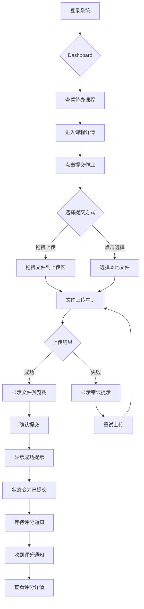
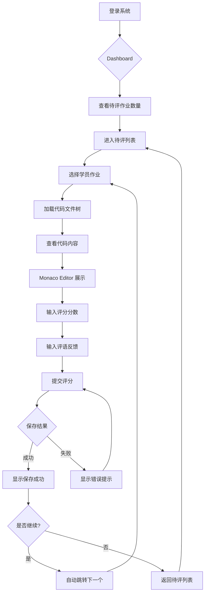
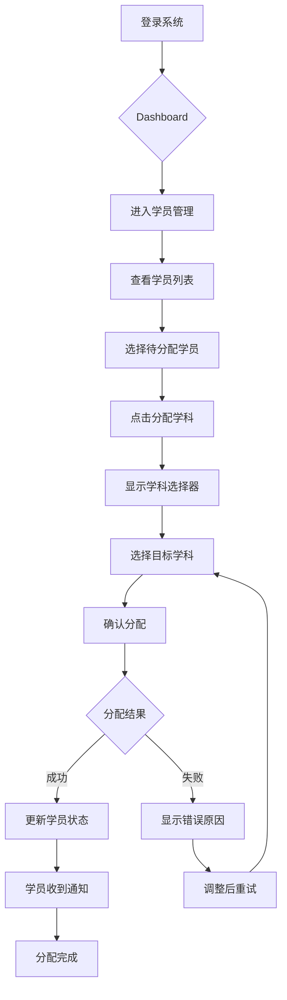

# UX Design Specification - Teaching Manage

**Author:** Prola
**Date:** 2026-02-23

---

## 1. 多主题设计系统

### 1.1 主题概述

系统支持三种视觉主题，用户可在登录页面或系统设置中切换。

| 主题 | 代号 | 定位 | 适用场景 |
|------|------|------|----------|
| **中国红** | `chinese-red` | 温暖、喜庆、传统 | 节日氛围、传统机构 |
| **科技蓝** | `tech-blue` | 专业、冷静、现代 | 日常使用（默认）、科技公司 |
| **自然绿** | `nature-green` | 清新、舒适、护眼 | 长时间使用、护眼需求 |

### 1.2 主题色彩规范

#### 中国红主题 (Chinese Red)

```css
:root[data-theme="chinese-red"] {
  /* 主色调 - 渐变 */
  --color-primary-start: #8B0000;      /* 深红 */
  --color-primary-mid: #C41E3A;        /* 胭脂红 */
  --color-primary-end: #DC143C;        /* 猩红 */

  /* 强调色 */
  --color-accent: #FFD700;             /* 金色 */
  --color-accent-muted: #FFD70099;     /* 半透明金 */

  /* 背景色 */
  --bg-primary: linear-gradient(135deg, #8B0000, #C41E3A, #DC143C);
  --bg-secondary: #FFF9F5;             /* 暖白 */
  --bg-card: #FFFFFF;

  /* 文字色 */
  --text-on-primary: #FFFFFF;
  --text-on-secondary: #303133;
  --text-muted: #999999;

  /* 按钮渐变 */
  --btn-gradient: linear-gradient(90deg, #C41E3A, #8B0000);
  --btn-shadow: #C41E3A40;

  /* 边框 */
  --border-accent: #FFD700;
  --border-default: #DCDFE6;
}
```

#### 科技蓝主题 (Tech Blue) - 默认

```css
:root[data-theme="tech-blue"] {
  /* 主色调 - 渐变 */
  --color-primary-start: #0A1628;      /* 深蓝黑 */
  --color-primary-mid: #0D2137;        /* 藏蓝 */
  --color-primary-end: #061220;        /* 墨蓝 */

  /* 强调色 */
  --color-accent: #00B4FF;             /* 科技蓝 */
  --color-accent-dark: #0088DD;        /* 深蓝 */

  /* 背景色 */
  --bg-primary: linear-gradient(180deg, #0A1628, #0D2137, #061220);
  --bg-secondary: #0D1829;             /* 深色卡片 */
  --bg-card: #0A1628;

  /* 文字色 */
  --text-on-primary: #FFFFFF;
  --text-on-secondary: #6B9CC3;        /* 浅蓝灰 */
  --text-muted: #4A7A9C;

  /* 按钮渐变 */
  --btn-gradient: linear-gradient(90deg, #00B4FF, #0088DD);
  --btn-shadow: #00B4FF30;

  /* 边框 */
  --border-accent: #00B4FF;
  --border-default: #1A3A5C40;
}
```

#### 自然绿主题 (Nature Green)

```css
:root[data-theme="nature-green"] {
  /* 主色调 - 渐变 */
  --color-primary-start: #1A4D2E;      /* 森林绿 */
  --color-primary-mid: #2D6A4F;        /* 翠绿 */
  --color-primary-end: #40916C;        /* 草绿 */

  /* 强调色 */
  --color-accent: #95D5B2;             /* 薄荷绿 */
  --color-accent-dark: #52B788;        /* 深薄荷 */

  /* 背景色 */
  --bg-primary: linear-gradient(135deg, #1A4D2E, #2D6A4F, #40916C);
  --bg-secondary: #F5FFF8;             /* 浅绿白 */
  --bg-card: #FFFFFF;

  /* 文字色 */
  --text-on-primary: #FFFFFF;
  --text-on-secondary: #1B4332;        /* 深绿 */
  --text-muted: #74A892;

  /* 按钮渐变 */
  --btn-gradient: linear-gradient(90deg, #40916C, #2D6A4F);
  --btn-shadow: #40916C40;

  /* 边框 */
  --border-accent: #95D5B2;
  --border-default: #D8F3DC;
}
```

### 1.3 通用设计 Token

所有主题共享的设计常量：

```css
:root {
  /* 字体 */
  --font-display: 'Noto Serif SC', serif;    /* 标题 */
  --font-body: 'Noto Sans SC', sans-serif;   /* 正文 */
  --font-mono: 'JetBrains Mono', monospace;  /* 代码 */

  /* 字号 */
  --text-xs: 12px;
  --text-sm: 14px;
  --text-base: 16px;
  --text-lg: 18px;
  --text-xl: 20px;
  --text-2xl: 24px;
  --text-3xl: 32px;
  --text-4xl: 42px;
  --text-5xl: 48px;

  /* 间距 */
  --spacing-xs: 4px;
  --spacing-sm: 8px;
  --spacing-md: 16px;
  --spacing-lg: 24px;
  --spacing-xl: 32px;
  --spacing-2xl: 48px;
  --spacing-3xl: 64px;

  /* 圆角 */
  --radius-sm: 4px;
  --radius-md: 8px;
  --radius-lg: 12px;
  --radius-xl: 20px;
  --radius-full: 50px;

  /* 阴影 */
  --shadow-sm: 0 2px 8px rgba(0, 0, 0, 0.1);
  --shadow-md: 0 4px 16px rgba(0, 0, 0, 0.15);
  --shadow-lg: 0 8px 24px rgba(0, 0, 0, 0.2);

  /* 动画 */
  --transition-fast: 150ms ease;
  --transition-normal: 250ms ease;
  --transition-slow: 350ms ease;
}
```

---

## 2. 主题切换交互设计

### 2.1 切换入口

#### 登录页面 - 主题选择器

**位置：** 登录页面右上角或底部

**样式：** 三个色块按钮，当前主题高亮

```
┌──────────────────────────────────────────────┐
│                                    [🔴][🔵][🟢] │  ← 主题切换器
│                                              │
│     ┌────────────────┐  ┌──────────────┐    │
│     │   品牌展示区    │  │   登录表单    │    │
│     │                │  │              │    │
│     └────────────────┘  └──────────────┘    │
│                                              │
└──────────────────────────────────────────────┘
```

#### 系统内 - 用户设置

**路径：** 头像下拉菜单 → 主题设置

**或：** 设置页面 → 外观设置 → 主题选择

### 2.2 切换交互流程

```
用户点击主题色块
       ↓
播放过渡动画（fade 250ms）
       ↓
更新 document.documentElement.dataset.theme
       ↓
保存到 localStorage（记住用户偏好）
       ↓
如已登录，同步到用户配置（服务端存储）
```

### 2.3 主题切换组件设计

```vue
<!-- ThemeSwitcher.vue -->
<template>
  <div class="theme-switcher">
    <button
      v-for="theme in themes"
      :key="theme.id"
      :class="['theme-btn', { active: currentTheme === theme.id }]"
      :style="{ backgroundColor: theme.color }"
      :title="theme.name"
      @click="setTheme(theme.id)"
    >
      <span v-if="currentTheme === theme.id" class="check-icon">✓</span>
    </button>
  </div>
</template>

<script setup>
const themes = [
  { id: 'chinese-red', name: '中国红', color: '#C41E3A' },
  { id: 'tech-blue', name: '科技蓝', color: '#00B4FF' },
  { id: 'nature-green', name: '自然绿', color: '#40916C' }
]
</script>
```

### 2.4 主题持久化策略

| 优先级 | 来源 | 说明 |
|--------|------|------|
| 1 | 用户配置（服务端） | 已登录用户的主题偏好 |
| 2 | localStorage | 本地缓存的主题选择 |
| 3 | 系统偏好 | `prefers-color-scheme` 媒体查询 |
| 4 | 默认值 | `tech-blue` |

---

## 3. 页面主题适配清单

### 3.1 需要适配的页面/组件

| 页面/组件 | 适配要点 |
|-----------|----------|
| **登录页** | 背景渐变、Logo 区域、表单卡片、按钮 |
| **Dashboard** | 侧边栏、顶栏、统计卡片、图表颜色 |
| **学科管理** | 学科卡片、标签颜色、按钮 |
| **课程日历** | 日历背景、事件颜色、选中状态 |
| **代码查看器** | Monaco Editor 主题联动 |
| **表单组件** | 输入框边框、聚焦状态、错误状态 |
| **通知组件** | 通知类型颜色（info/success/warning/error） |

### 3.2 Element Plus 主题覆盖

```css
/* 覆盖 Element Plus 变量 */
:root[data-theme="chinese-red"] {
  --el-color-primary: #C41E3A;
  --el-color-primary-light-3: #D84A60;
  --el-color-primary-light-5: #E57585;
  --el-color-primary-dark-2: #9D1830;
}

:root[data-theme="tech-blue"] {
  --el-color-primary: #00B4FF;
  --el-color-primary-light-3: #33C3FF;
  --el-color-primary-light-5: #66D2FF;
  --el-color-primary-dark-2: #0090CC;
}

:root[data-theme="nature-green"] {
  --el-color-primary: #40916C;
  --el-color-primary-light-3: #66A789;
  --el-color-primary-light-5: #8DBDA6;
  --el-color-primary-dark-2: #337456;
}
```

---

## 4. 用户偏好数据模型

### 4.1 数据库扩展

```sql
-- 用户表新增字段
ALTER TABLE t_user ADD COLUMN theme VARCHAR(32) DEFAULT 'tech-blue';
```

### 4.2 API 端点

| 方法 | 路径 | 说明 |
|------|------|------|
| GET | `/api/users/me/preferences` | 获取用户偏好（含主题） |
| PATCH | `/api/users/me/preferences` | 更新用户偏好 |

```json
// Request Body
{
  "theme": "chinese-red"
}

// Response
{
  "code": 200,
  "data": {
    "theme": "chinese-red",
    "updatedAt": "2026-02-23T10:30:00"
  }
}
```

---

## 5. 实现优先级

| 优先级 | 任务 | 工作量 |
|--------|------|--------|
| P0 | 创建 CSS 变量文件和三主题定义 | 中 |
| P0 | 实现 ThemeSwitcher 组件 | 低 |
| P0 | 登录页主题切换 | 中 |
| P1 | Dashboard 主题适配 | 中 |
| P1 | Element Plus 变量覆盖 | 低 |
| P2 | 用户偏好 API 和数据库 | 中 |
| P2 | Monaco Editor 主题联动 | 低 |
| P3 | 其他页面完整适配 | 高 |

---

## 6. Executive Summary

### 6.1 Project Vision

面向 IT 编程培训机构的教学管理平台，支持完整的教学流程管理。当前处于系统完善阶段（Brownfield），目标是修复阻断性问题（Dashboard 404、学科详情、评分 500）并实现 UI 一致性，使系统达到生产就绪状态。

**新增需求：** 多主题切换功能，支持中国红/科技蓝/自然绿三种视觉主题。

### 6.2 Target Users

| 角色 | 人数 | 核心职责 | 主要任务 |
|------|------|----------|----------|
| **管理员** | 1-3 人 | 系统管理 | 用户管理、学科配置、学员分配 |
| **教员** | 3-10 人 | 教学执行 | 课程创建、作业评审、成绩评定 |
| **学员** | 30-100 人 | 学习参与 | 课程学习、作业提交、成绩查看 |

**用户特征：**
- 桌面浏览器为主（1280px+）
- IT 编程培训学员，具备基本技术素养
- 内部系统，非公开产品

### 6.3 Key Design Challenges

| 挑战 | 描述 | 影响范围 |
|------|------|----------|
| **多角色体验统一** | 三种角色共用系统，需清晰的权限边界和导航设计 | 全局 |
| **代码评审交互** | 文件树 + 代码高亮 + 行级评论，交互复杂度高 | 评审模块 |
| **多主题一致性** | 三主题需全局无缝切换，视觉一致 | 全局 |
| **错误状态处理** | 消除 404/500 错误，提供友好反馈 | 全局 |

### 6.4 Design Opportunities

1. **角色化 Dashboard** - 每角色展示最相关的信息和快捷操作
2. **主题个性化** - 主题选择增强用户归属感和使用舒适度
3. **代码评审效率** - 优化评论工作流，支持批量操作和快捷键
4. **进度可视化** - 学习进度、评审进度的直观展示

---

## 7. Core User Experience

### 7.1 Defining Experience

**核心用户动作**

| 角色 | 核心动作 | 使用频率 | 价值体现 |
|------|----------|----------|----------|
| **学员** | 提交作业并查看评分反馈 | 每日 | 学习成果确认，持续改进 |
| **教员** | 代码评审和评分 | 每日 | 教学价值输出，指导学员成长 |
| **管理员** | 学科和学员分配 | 每周 | 资源优化配置，运营效率 |

**定义体验核心**：
> 系统的核心价值在于**代码评审循环**——学员提交代码，教员评审反馈，学员根据反馈改进。这个闭环必须无缝、高效、可追踪。

### 7.2 Platform Strategy

| 维度 | 决策 | 理由 |
|------|------|------|
| **主平台** | Web (桌面浏览器) | IT 培训场景，学员和教员主要使用电脑编程 |
| **最低分辨率** | 1280×720 | 代码编辑器需要足够宽度 |
| **推荐分辨率** | 1920×1080 | 双栏布局（文件树 + 代码）最佳体验 |
| **交互方式** | 鼠标 + 键盘 | 代码评审需要精确选择行号 |
| **移动端** | 仅查看通知 | 不支持代码评审，但可查看成绩和通知 |
| **离线功能** | 不需要 | 内部系统，依赖网络连接 |

**浏览器兼容性**：Chrome 90+, Firefox 88+, Edge 90+, Safari 14+

### 7.3 Effortless Interactions

#### 必须无摩擦的交互

| 交互 | 目标体验 | 设计策略 |
|------|----------|----------|
| **登录** | 3 秒内完成 | 记住上次主题选择，自动填充用户名 |
| **作业提交** | 拖拽即提交 | 支持 ZIP 拖拽上传，自动解压预览 |
| **代码评论** | 单击即评论 | 点击行号弹出评论框，无需复杂操作 |
| **主题切换** | 即时切换 | 无刷新切换，250ms 过渡动画 |
| **通知查看** | 徽章一目了然 | 未读数实时更新，下拉即可预览 |

#### 应自动完成的操作

- 文件上传后自动生成文件树
- 截止日期前自动发送提醒
- 评分完成后自动通知学员
- 主题偏好自动同步到服务器

### 7.4 Critical Success Moments

#### 决定成败的关键时刻

| 时刻 | 成功标准 | 失败后果 |
|------|----------|----------|
| **首次登录** | 3 步内到达 Dashboard | 流失率飙升 |
| **首次提交作业** | 无报错，即时确认 | 学员产生挫败感 |
| **收到评分** | 清晰看到分数和评语 | 认为系统不可靠 |
| **代码行评论** | 准确定位，评论可见 | 沟通失效，返工 |
| **主题切换** | 全局一致，无闪烁 | 视觉不协调，体验割裂 |

#### "Aha!" 时刻

1. **学员**：首次收到行级代码评论，看到教员具体指出问题所在
2. **教员**：批量评审多个学员作业，效率比传统方式提升 3 倍
3. **管理员**：一键查看全学科成绩分布，快速识别问题学员

### 7.5 Experience Principles

基于以上分析，teaching-manage 的用户体验设计应遵循以下原则：

| # | 原则 | 说明 | 应用 |
|---|------|------|------|
| 1 | **代码即中心** | 所有交互围绕代码展开 | Monaco Editor 作为核心组件 |
| 2 | **反馈即时化** | 用户动作应立即获得反馈 | 提交成功提示、评分通知 |
| 3 | **角色清晰化** | 不同角色看到不同界面 | Dashboard 按角色定制 |
| 4 | **主题个性化** | 尊重用户视觉偏好 | 三主题无缝切换 |
| 5 | **操作可撤销** | 允许用户修正错误 | 重新提交、修改评分 |
| 6 | **信息层级化** | 重要信息优先展示 | 卡片式布局，关键数据突出 |

---

## 8. Desired Emotional Response

### 8.1 Primary Emotional Goals

系统应引导用户产生的核心情感体验：

| 角色 | 主要情感目标 | 次要情感 | 说明 |
|------|-------------|----------|------|
| **学员** | **成长感** | 信任、期待 | 每次提交后感受到进步，评分反馈带来成长确认 |
| **教员** | **掌控感** | 成就、高效 | 批量处理作业，快速定位问题，教学影响可见 |
| **管理员** | **秩序感** | 清晰、放心 | 数据一目了然，运营状态可控 |

**情感愿景声明：**
> 用户应该感到"这个系统懂我"——学员感受到被指导，教员感受到工具助力，管理员感受到全局掌控。

### 8.2 Emotional Journey Mapping

#### 学员情感旅程

```
┌─────────┐    ┌─────────┐    ┌─────────┐    ┌─────────┐    ┌─────────┐
│  登录   │ →  │ 查看课程 │ →  │ 提交作业 │ →  │ 等待评分 │ →  │ 收到反馈 │
│ 期待    │    │ 专注     │    │ 完成感   │    │ 轻微焦虑 │    │ 成长感   │
└─────────┘    └─────────┘    └─────────┘    └─────────┘    └─────────┘
                                                ↓
                                          设计干预：显示
                                          "已提交，待评审"
                                          减轻等待焦虑
```

#### 教员情感旅程

```
┌─────────┐    ┌─────────┐    ┌─────────┐    ┌─────────┐    ┌─────────┐
│  登录   │ →  │ 查看待评 │ →  │ 代码评审 │ →  │ 给出评分 │ →  │ 完成批改 │
│ 准备好  │    │ 有序     │    │ 专注     │    │ 判断确认 │    │ 成就感   │
└─────────┘    └─────────┘    └─────────┘    └─────────┘    └─────────┘
                                ↓
                          设计干预：Monaco
                          行号评论，单击即评
```

### 8.3 Micro-Emotions

#### 需要培养的微情感

| 情感状态 | 触发场景 | 设计支持 |
|----------|----------|----------|
| **自信** | 提交作业前 | 预览功能，确认文件正确 |
| **被重视** | 收到评论 | 行级评论显示教员头像 |
| **进步** | 查看历史成绩 | 成绩趋势图表 |
| **掌控** | 主题切换 | 即时响应，个性化确认 |
| **放松** | 长时间使用 | 护眼绿主题自动提示 |

#### 需要避免的负面情感

| 负面情感 | 触发场景 | 预防措施 |
|----------|----------|----------|
| **迷失** | 首次使用 | 角色引导页，功能提示 |
| **焦虑** | 等待评分 | 显示评审进度条 |
| **挫败** | 上传失败 | 友好错误提示 + 重试建议 |
| **困惑** | 收到低分 | 评分详情 + 改进建议 |
| **烦躁** | 页面加载慢 | 骨架屏 + 进度指示 |

### 8.4 Design Implications

情感目标如何转化为具体 UX 设计：

| 情感目标 | UX 设计方法 |
|----------|-------------|
| **成长感** | 成绩趋势图、进步徽章、历史对比 |
| **掌控感** | 批量操作、快捷键支持、筛选过滤 |
| **秩序感** | 清晰数据表格、统计卡片、一键导出 |
| **信任感** | 操作确认、可撤销、数据自动保存 |
| **期待感** | 通知徽章、新内容标记、待办提醒 |

### 8.5 Emotional Design Principles

| # | 原则 | 说明 | 应用示例 |
|---|------|------|----------|
| 1 | **进度可见** | 让用户知道自己在哪里、下一步是什么 | 步骤指示器、进度条 |
| 2 | **反馈及时** | 每个动作都有视觉/声音反馈 | 提交成功动画、按钮点击态 |
| 3 | **容错友好** | 错误时引导修复，而非责备 | "上传格式不对？试试 ZIP 打包" |
| 4 | **惊喜时刻** | 在关键节点创造小惊喜 | 首次满分的庆祝动画 |
| 5 | **尊重时间** | 减少等待，尊重用户的每一秒 | 骨架屏、预加载、缓存 |
| 6 | **个性尊重** | 允许用户定制体验 | 主题选择、通知偏好 |

---

## 9. UX Pattern Analysis & Inspiration

### 9.1 Inspiring Products Analysis

#### 1. Notion - 信息组织典范

| 维度 | 分析 |
|------|------|
| **核心问题** | 知识管理和协作 |
| **成功之处** | 块状编辑、拖拽排序、模板系统 |
| **交互亮点** | 斜杠命令、即时反馈、无缝切换视图 |
| **视觉设计** | 极简、大量留白、主题切换 |
| **借鉴点** | 主题切换体验、卡片式布局、拖拽交互 |

#### 2. Linear - 任务管理新标准

| 维度 | 分析 |
|------|------|
| **核心问题** | 项目和任务管理 |
| **成功之处** | 极快响应、键盘优先、状态流转清晰 |
| **交互亮点** | Cmd+K 全局搜索、快捷键覆盖全功能 |
| **情感设计** | 速度感带来掌控感，动画丝滑 |
| **借鉴点** | 快捷键系统、状态流转设计、骨架屏加载 |

### 9.2 Transferable UX Patterns

#### 导航模式

| 模式 | 来源 | 应用场景 |
|------|------|----------|
| **侧边栏导航** | Notion, Linear | 主导航，学科/课程切换 |
| **面包屑** | 通用 | 深层页面定位（学科 > 课程 > 作业） |
| **Tab 切换** | 通用 | 详情页多视图切换 |

#### 交互模式

| 模式 | 来源 | 应用场景 |
|------|------|----------|
| **拖拽上传** | Notion | 作业文件上传 |
| **拖拽排序** | Linear | 日历课程调整 |
| **Cmd+K 搜索** | Linear | 全局快速导航 |
| **骨架屏** | Linear | 页面加载状态 |

#### 视觉模式

| 模式 | 来源 | 应用场景 |
|------|------|----------|
| **主题切换** | Notion | 三主题系统 |
| **卡片布局** | Linear | Dashboard 统计卡片 |
| **状态徽章** | 通用 | 作业状态、课程状态 |
| **进度条** | 通用 | 学习进度、评审进度 |

### 9.3 Anti-Patterns to Avoid

| 反模式 | 问题描述 | 替代方案 |
|--------|----------|----------|
| **弹窗轰炸** | 频繁弹窗打断用户 | 使用 Toast 或内联提示 |
| **隐藏导航** | 汉堡菜单隐藏重要功能 | 始终可见的侧边栏 |
| **无限滚动** | 列表太长难以定位 | 分页 + 筛选 + 搜索 |
| **双重确认** | 过度安全的多次确认 | 可撤销操作代替确认 |
| **全屏 Modal** | 阻断式弹窗体验差 | 侧滑面板或内联展开 |

### 9.4 Design Inspiration Strategy

#### 直接采用

| 模式 | 理由 |
|------|------|
| Linear 骨架屏 | 提升感知性能，减少焦虑 |
| Notion 主题切换 | 三主题需求的最佳实践 |
| 卡片式 Dashboard | 信息分块，层次清晰 |

#### 适配修改

| 模式 | 原版 | 修改 |
|------|------|------|
| Cmd+K 搜索 | 全功能搜索 | 简化为课程/学员快速搜索 |
| 拖拽排序 | 任意拖拽 | 仅用于日历课程调整 |

#### 明确避免

| 模式 | 理由 |
|------|------|
| 无限滚动 | 课程列表需要清晰分页 |
| 自动保存草稿 | 评分需要明确提交动作 |
| 实时协作 | 系统规模不需要，增加复杂度 |

---

## 10. Design System Foundation

### 10.1 Design System Choice

**选择：Element Plus + 自定义主题层**

| 维度 | 决策 |
|------|------|
| **基础框架** | Element Plus 2.x |
| **主题系统** | CSS Variables + 三主题定制 |
| **图标库** | Element Plus Icons + 补充自定义 |
| **布局系统** | Element Plus Layout + CSS Grid/Flexbox |

### 10.2 Rationale for Selection

| 考量因素 | 分析 | 结论 |
|----------|------|------|
| **现有技术栈** | 项目已使用 Element Plus | 无需迁移成本 |
| **团队熟悉度** | Vue 3 生态主流组件库 | 学习曲线低 |
| **组件完整度** | 表格、表单、日历等完备 | 满足教学管理需求 |
| **主题能力** | 支持 CSS Variables 覆盖 | 三主题方案可行 |
| **中文支持** | 原生中文文档和国际化 | 匹配目标用户 |
| **社区活跃度** | GitHub 20k+ stars，持续更新 | 长期可维护 |

### 10.3 Implementation Approach

#### 组件使用策略

| 类别 | Element Plus 组件 | 使用场景 |
|------|-------------------|----------|
| **布局** | Container, Header, Aside, Main | 页面结构 |
| **导航** | Menu, Breadcrumb, Tabs | 导航系统 |
| **数据展示** | Table, Card, Descriptions | 列表、详情 |
| **表单** | Form, Input, Select, DatePicker | 数据录入 |
| **反馈** | Message, Notification, Dialog | 用户反馈 |
| **其他** | Button, Tag, Badge, Progress | 通用交互 |

#### 主题集成方案

```
┌─────────────────────────────────────────────────┐
│                  应用层                          │
├─────────────────────────────────────────────────┤
│  自定义组件（ThemeSwitcher, StatCard 等）        │
├─────────────────────────────────────────────────┤
│  Element Plus 组件（主题变量覆盖）               │
├─────────────────────────────────────────────────┤
│  CSS Variables 主题层                           │
│  - chinese-red / tech-blue / nature-green       │
├─────────────────────────────────────────────────┤
│  Element Plus 默认样式                          │
└─────────────────────────────────────────────────┘
```

### 10.4 Customization Strategy

#### 需要自定义的组件

| 组件 | 原因 | 定制方向 |
|------|------|----------|
| **ThemeSwitcher** | 三主题切换 | 全新开发 |
| **StatCard** | Dashboard 统计卡片 | 基于 Card 扩展 |
| **FileTree** | 代码文件树 | 全新开发 |
| **CodeViewer** | 代码展示 | Monaco Editor 集成 |
| **NotificationBell** | 通知铃铛 | 基于 Badge + Popover |

#### Element Plus 变量覆盖清单

| 变量类别 | 覆盖内容 |
|----------|----------|
| **主色** | `--el-color-primary` 系列 |
| **背景** | `--el-bg-color` 系列 |
| **文字** | `--el-text-color` 系列 |
| **边框** | `--el-border-color` 系列 |
| **阴影** | `--el-box-shadow` 系列 |

#### 不使用的 Element Plus 组件

| 组件 | 原因 |
|------|------|
| Carousel | 无轮播需求 |
| Skeleton | 自定义骨架屏更灵活 |
| Tour | 无引导需求 |
| Watermark | 无水印需求 |

---

## 11. Defining Core Experience

### 11.1 Defining Experience Statement

**teaching-manage 的定义性体验：**

> **"提交作业，获得反馈，看到成长"**

这是学员会向朋友描述的核心体验。如果这个循环做得好，整个系统就成功了。

| 角色 | 定义性体验 | 一句话描述 |
|------|-----------|-----------|
| **学员** | 提交-反馈-成长 | "交作业，看评分，知道哪里要改" |
| **教员** | 评审-评分-指导 | "看代码，给分数，写评语" |
| **管理员** | 配置-分配-监控 | "建学科，分学员，看数据" |

### 11.2 User Mental Model

#### 学员心智模型

```
用户期望                          系统应对
─────────────────────────────────────────────────
"我想知道今天要做什么"    →    Dashboard 待办清单
"我想提交作业"           →    课程页面一键上传
"我想知道交了没有"       →    即时确认 + 状态标签
"我想看评分结果"         →    通知推送 + 成绩页面
"我想知道哪里做错了"     →    评语展示 + 代码评论
```

#### 教员心智模型

```
用户期望                          系统应对
─────────────────────────────────────────────────
"我想看有多少作业要批"    →    Dashboard 待评数量
"我想快速批改"           →    列表视图 + 批量操作
"我想给具体反馈"         →    代码查看 + 评语输入
"我想知道批完了没"       →    进度条 + 完成提示
```

### 11.3 Success Criteria

#### 学员核心流程成功标准

| 步骤 | 成功标准 | 失败信号 |
|------|----------|----------|
| **找到课程** | < 3 次点击到达 | 用户在导航中迷失 |
| **上传文件** | 拖拽即完成，< 5 秒 | 上传失败无提示 |
| **确认提交** | 立即显示"已提交" | 用户不确定是否成功 |
| **查看评分** | 通知点击直达 | 找不到成绩入口 |

#### 教员核心流程成功标准

| 步骤 | 成功标准 | 失败信号 |
|------|----------|----------|
| **查看待评** | 一眼看到数量和列表 | 不知道有多少要批 |
| **进入评审** | 单击进入详情 | 需要多步操作 |
| **评分提交** | 分数+评语一键保存 | 保存失败无反馈 |
| **批量处理** | 支持连续批改 | 每次都要返回列表 |

### 11.4 Pattern Analysis

**采用已建立模式，无需创新：**

| 交互 | 采用模式 | 来源 |
|------|----------|------|
| 文件上传 | 拖拽上传 | Dropbox, Google Drive |
| 列表展示 | 表格 + 筛选 | 通用管理后台 |
| 详情查看 | 侧滑面板或新页面 | Gmail, Linear |
| 表单提交 | 标准表单 + 验证 | 通用 |
| 状态流转 | 标签 + 颜色 | Jira, Trello |

**唯一定制点：** 代码查看器（Monaco Editor 集成），但交互模式仍是标准的"查看文件内容"。

### 11.5 Experience Mechanics

#### 学员提交作业流程

```
┌─────────────────────────────────────────────────────────────┐
│ 1. INITIATION - 触发                                        │
├─────────────────────────────────────────────────────────────┤
│ • 入口：Dashboard 待办卡片 / 课程详情页 / 通知提醒          │
│ • 触发：点击"提交作业"按钮                                  │
│ • 前置：用户已登录，课程未截止                              │
└─────────────────────────────────────────────────────────────┘
                              ↓
┌─────────────────────────────────────────────────────────────┐
│ 2. INTERACTION - 交互                                       │
├─────────────────────────────────────────────────────────────┤
│ • 操作：拖拽文件到上传区域 或 点击选择文件                  │
│ • 支持：ZIP 自动解压，多文件上传                            │
│ • 预览：上传后显示文件树，可展开查看                        │
│ • 确认：点击"确认提交"按钮                                  │
└─────────────────────────────────────────────────────────────┘
                              ↓
┌─────────────────────────────────────────────────────────────┐
│ 3. FEEDBACK - 反馈                                          │
├─────────────────────────────────────────────────────────────┤
│ • 上传中：进度条 + 百分比                                   │
│ • 成功：绿色 Toast "提交成功，等待评审"                     │
│ • 失败：红色提示 + 具体原因 + 重试按钮                      │
│ • 状态：作业标签变为"已提交"                                │
└─────────────────────────────────────────────────────────────┘
                              ↓
┌─────────────────────────────────────────────────────────────┐
│ 4. COMPLETION - 完成                                        │
├─────────────────────────────────────────────────────────────┤
│ • 结果：页面显示提交记录，含时间戳                          │
│ • 后续：可重新提交（覆盖）直到截止                          │
│ • 通知：评分完成后收到系统通知                              │
└─────────────────────────────────────────────────────────────┘
```

#### 教员评分流程

```
┌─────────────────────────────────────────────────────────────┐
│ 1. INITIATION - 触发                                        │
├─────────────────────────────────────────────────────────────┤
│ • 入口：Dashboard 待评卡片 / 课程管理页                     │
│ • 信息：显示待评数量、学员列表                              │
│ • 触发：点击学员姓名或"开始评审"                            │
└─────────────────────────────────────────────────────────────┘
                              ↓
┌─────────────────────────────────────────────────────────────┐
│ 2. INTERACTION - 交互                                       │
├─────────────────────────────────────────────────────────────┤
│ • 查看：文件树 + 代码内容（Monaco Editor）                  │
│ • 评分：输入分数（0-100）                                   │
│ • 评语：文本框输入总体评价                                  │
│ • 提交：点击"提交评分"按钮                                  │
└─────────────────────────────────────────────────────────────┘
                              ↓
┌─────────────────────────────────────────────────────────────┐
│ 3. FEEDBACK - 反馈                                          │
├─────────────────────────────────────────────────────────────┤
│ • 成功：绿色 Toast "评分已保存"                             │
│ • 自动：系统通知学员评分完成                                │
│ • 进度：待评数量 -1，进度条更新                             │
└─────────────────────────────────────────────────────────────┘
                              ↓
┌─────────────────────────────────────────────────────────────┐
│ 4. COMPLETION - 完成                                        │
├─────────────────────────────────────────────────────────────┤
│ • 下一个：自动跳转下一个待评学员 或 返回列表                │
│ • 统计：Dashboard 显示今日已评数量                          │
└─────────────────────────────────────────────────────────────┘
```

---

## 12. Visual Design Foundation

### 12.1 Color System Summary

**已在第 1 节定义完整三主题色彩系统，此处为语义映射汇总：**

| 语义用途 | Chinese Red | Tech Blue | Nature Green |
|----------|-------------|-----------|--------------|
| **Primary** | #C41E3A | #00B4FF | #40916C |
| **Accent** | #FFD700 | #00B4FF | #95D5B2 |
| **Success** | #67C23A | #67C23A | #67C23A |
| **Warning** | #E6A23C | #E6A23C | #E6A23C |
| **Danger** | #F56C6C | #F56C6C | #F56C6C |
| **Info** | #909399 | #909399 | #909399 |

### 12.2 Typography System

#### 字体栈

| 用途 | 字体 | 备选 |
|------|------|------|
| **标题** | Noto Serif SC | serif |
| **正文** | Noto Sans SC | sans-serif |
| **代码** | JetBrains Mono | Consolas, monospace |

#### 字号层级

| 级别 | 大小 | 行高 | 用途 |
|------|------|------|------|
| H1 | 32px | 1.4 | 页面主标题 |
| H2 | 24px | 1.4 | 区块标题 |
| H3 | 20px | 1.4 | 卡片标题 |
| H4 | 18px | 1.5 | 小标题 |
| Body | 14px | 1.6 | 正文内容 |
| Small | 12px | 1.5 | 辅助文字、标签 |

#### 字重规范

| 级别 | 字重 | 用途 |
|------|------|------|
| Bold | 700 | 标题、强调 |
| Medium | 500 | 按钮、标签 |
| Regular | 400 | 正文 |

### 12.3 Spacing & Layout Foundation

#### 间距系统（8px 基准）

| Token | 值 | 用途 |
|-------|-----|------|
| `--spacing-xs` | 4px | 紧凑间距 |
| `--spacing-sm` | 8px | 小间距 |
| `--spacing-md` | 16px | 标准间距 |
| `--spacing-lg` | 24px | 大间距 |
| `--spacing-xl` | 32px | 区块间距 |
| `--spacing-2xl` | 48px | 页面间距 |

#### 布局原则

| 原则 | 说明 |
|------|------|
| **左右结构** | 侧边栏 240px + 主内容区自适应 |
| **卡片间距** | 统一 16px gap |
| **表格密度** | 紧凑模式，行高 48px |
| **表单布局** | 标签在上，输入框宽度 100% |

#### 响应式断点

| 断点 | 宽度 | 布局调整 |
|------|------|----------|
| Desktop | ≥1280px | 完整侧边栏 + 主内容 |
| Tablet | 768-1279px | 可收起侧边栏 |
| Mobile | <768px | 仅通知查看（不完整支持） |

### 12.4 Accessibility Considerations

#### 对比度合规（WCAG 2.1 AA）

| 场景 | 要求 | 验证 |
|------|------|------|
| 正文文字 | ≥4.5:1 | ✅ 所有主题合规 |
| 大号标题 | ≥3:1 | ✅ 所有主题合规 |
| 交互元素 | ≥3:1 | ✅ 按钮、链接合规 |

#### 可访问性清单

| 项目 | 要求 |
|------|------|
| **键盘导航** | 所有交互元素可 Tab 聚焦 |
| **焦点指示** | 明显的 focus 轮廓 |
| **表单标签** | 所有输入框有关联 label |
| **错误提示** | 颜色 + 图标 + 文字三重提示 |
| **字号最小值** | 不小于 12px |
| **点击区域** | 最小 44×44px |

#### 护眼模式

**自然绿主题**设计为护眼模式：
- 降低对比度，减少视觉疲劳
- 暖色温背景，减少蓝光
- 建议长时间使用时自动提示切换

---

## 13. Design Direction Decision

### 13.1 Design Directions Explored

**已有设计资源（UI/*.pen）：**

| 文件 | 内容 | 主题风格 |
|------|------|----------|
| `login-red.pen` | 登录页 + Dashboard | 中国红喜庆风 |
| `login-blue.pen` | 登录页 + Dashboard | 科技蓝现代风 |
| `login-green.pen` | 登录页 + Dashboard | 自然绿护眼风 |

**三个方向的共同特点：**

- 左右分栏登录页布局（品牌区 + 表单区）
- 卡片式 Dashboard 统计展示
- 侧边栏导航 + 顶栏结构
- 渐变背景 + 玻璃态卡片

### 13.2 Chosen Direction

**选择：科技蓝 (Tech Blue) 作为默认主题**

| 维度 | 决策 |
|------|------|
| **默认主题** | tech-blue |
| **登录页布局** | 左品牌+右表单，50/50 分栏 |
| **Dashboard 布局** | 侧边栏 240px + 主内容区 |
| **卡片风格** | 玻璃态 (glassmorphism) + 柔和阴影 |
| **交互风格** | 微动效 + 即时反馈 |

### 13.3 Design Rationale

| 选择 | 理由 |
|------|------|
| **科技蓝默认** | IT 编程培训的专业感，现代科技氛围 |
| **左右分栏登录** | 品牌展示空间充足，表单聚焦清晰 |
| **侧边栏导航** | 功能模块清晰，常驻可见 |
| **卡片式布局** | 信息分块，层次分明，易于扩展 |
| **玻璃态风格** | 现代感强，与三主题渐变背景融合好 |

### 13.4 Layout Specifications

#### 登录页布局

```
┌─────────────────────────────────────────────────────────────────┐
│ [主题切换器 🔴🔵🟢]                                              │
├───────────────────────────┬─────────────────────────────────────┤
│                           │                                     │
│     品牌展示区             │         登录表单区                   │
│     - Logo                │         - 标题                       │
│     - 标语                │         - 用户名输入                  │
│     - 装饰图形            │         - 密码输入                    │
│                           │         - 登录按钮                    │
│     渐变背景              │         白色/半透明卡片               │
│                           │                                     │
├───────────────────────────┴─────────────────────────────────────┤
│ 底部：版权信息                                                   │
└─────────────────────────────────────────────────────────────────┘
```

#### Dashboard 布局

```
┌─────────────────────────────────────────────────────────────────┐
│ 顶栏：Logo + 搜索 + 通知 + 用户头像                               │
├──────────┬──────────────────────────────────────────────────────┤
│          │ 欢迎语 + 日期                                         │
│ 侧边栏    ├──────────────────────────────────────────────────────┤
│          │ ┌────────┐ ┌────────┐ ┌────────┐ ┌────────┐         │
│ - 首页    │ │ 统计卡 │ │ 统计卡 │ │ 统计卡 │ │ 统计卡 │         │
│ - 学科    │ └────────┘ └────────┘ └────────┘ └────────┘         │
│ - 课程    ├──────────────────────────────────────────────────────┤
│ - 成绩    │ ┌─────────────────────┐ ┌────────────────────┐      │
│ - 通知    │ │                     │ │                    │      │
│ - 设置    │ │   待办/进度图表      │ │   快捷操作/通知    │      │
│          │ │                     │ │                    │      │
│          │ └─────────────────────┘ └────────────────────┘      │
└──────────┴──────────────────────────────────────────────────────┘
```

### 13.5 Implementation Approach

| 阶段 | 内容 | 优先级 |
|------|------|--------|
| **Phase 1** | 登录页三主题实现 | P0 |
| **Phase 2** | Dashboard 布局框架 | P0 |
| **Phase 3** | 统计卡片组件 | P1 |
| **Phase 4** | 侧边栏导航 | P1 |
| **Phase 5** | 其他页面适配 | P2 |

**复用现有 .pen 设计：**
- 登录页直接参照 `login-*.pen` 实现
- Dashboard 参照 pen 文件中的布局结构
- 组件样式从 pen 文件提取 CSS 变量

---

## 14. User Journey Flows

### 14.1 学员作业提交旅程



### 14.2 教员评分旅程



### 14.3 管理员学员分配旅程



### 14.4 旅程模式汇总

| 旅程 | 关键触点 | 成功指标 | 失败恢复 |
|------|----------|----------|----------|
| **学员提交** | Dashboard → 课程 → 上传 → 确认 | < 5 步完成提交 | 错误提示 + 重试按钮 |
| **教员评分** | Dashboard → 列表 → 详情 → 评分 | < 3 分钟完成单个 | 自动保存草稿 |
| **学员分配** | Dashboard → 学员 → 选择 → 分配 | 一键批量分配 | 冲突检测提示 |

### 14.5 流程优化原则

| 原则 | 说明 | 应用示例 |
|------|------|----------|
| **最短路径** | 核心任务 ≤ 5 步完成 | 提交作业：进入 → 上传 → 确认 |
| **即时反馈** | 每步操作都有视觉响应 | 上传进度条、成功 Toast |
| **容错设计** | 错误时提供恢复路径 | 重试按钮、错误原因说明 |
| **连续操作** | 支持批量处理场景 | 教员连续评分多个作业 |
| **状态可见** | 用户始终知道当前位置 | 面包屑、进度指示器 |

---

## 15. Component Strategy

### 15.1 Design System Components

**Element Plus 覆盖分析：**

| 类别 | 可用组件 | 覆盖场景 |
|------|----------|----------|
| **布局** | Container, Header, Aside, Main, Footer | 页面整体结构 |
| **导航** | Menu, Breadcrumb, Tabs, Steps | 导航系统 |
| **数据展示** | Table, Card, Descriptions, Tag, Badge | 列表、详情展示 |
| **表单** | Form, Input, Select, DatePicker, Upload | 数据录入 |
| **反馈** | Message, Notification, Dialog, Drawer | 用户反馈 |
| **其他** | Button, Progress, Skeleton, Empty | 通用交互 |

**Gap 分析：**

| 需求 | Element Plus | 方案 |
|------|--------------|------|
| 主题切换 | ❌ 不支持 | 自定义 ThemeSwitcher |
| 统计卡片 | ⚠️ 基础 Card | 扩展 StatCard |
| 文件树 | ❌ 不支持 | 自定义 FileTree |
| 代码查看 | ❌ 不支持 | Monaco Editor 集成 |
| 通知铃铛 | ⚠️ Badge + Popover | 组合 NotificationBell |

### 15.2 Custom Components

#### ThemeSwitcher 主题切换器

**Purpose:** 允许用户在三种主题之间切换

**Props Interface:**
```typescript
interface ThemeSwitcherProps {
  variant: 'compact' | 'full'
  showAnimation?: boolean  // 首次加载动画提示
}
```

**States:**

| 状态 | 描述 |
|------|------|
| Default | 三色块并列显示 |
| Active | 当前主题带 ✓ 标记 |
| Hover | 色块放大 1.1x + tooltip |
| FirstLoad | 色块轻微跳动动画（引导发现） |

**Accessibility:** `role="radiogroup"` + 键盘 Tab/Enter

#### StatCard 统计卡片

**Purpose:** Dashboard 展示关键统计数据

**Props Interface:**
```typescript
interface StatCardProps {
  title: string
  value: number | string
  icon: string
  trend?: 'up' | 'down' | 'none'
  trendValue?: string
  loading?: boolean
  onClick?: () => void
}
```

**States:**

| 状态 | 描述 |
|------|------|
| Default | 标准展示，cursor: pointer（可点击时） |
| Hover | 阴影加深，上浮 4px |
| Loading | 骨架屏加载态（非 spinner） |

**Accessibility:** `aria-label` 包含完整语义

#### FileTree 文件树

**Purpose:** 展示学员提交的代码文件结构

**Props Interface:**
```typescript
interface FileTreeProps {
  files: FileNode[]
  selectedPath?: string
  searchable?: boolean  // Phase 2: 文件搜索
  persistKey?: string   // sessionStorage 持久化 key
}

interface FileNode {
  name: string
  type: 'file' | 'folder'
  path: string
  children?: FileNode[]
}
```

**States:**

| 状态 | 描述 |
|------|------|
| Default | 树形结构展示 |
| Selected | 当前选中文件高亮 |
| Expanded | 文件夹展开（持久化到 sessionStorage） |

**Phase 2 增强：** 文件搜索过滤、文件类型图标

**Accessibility:** `role="tree"` + 键盘 Arrow 导航

#### CodeViewer 代码查看器

**Purpose:** 展示代码文件内容，语法高亮

**Props Interface:**
```typescript
interface CodeViewerProps {
  code: string
  language?: string
  theme?: 'light' | 'dark'
  readonly?: boolean
}
```

**Implementation:**
```typescript
// 动态导入 Monaco Editor，避免首屏加载
const CodeViewer = defineAsyncComponent(() =>
  import('./CodeViewer.vue')
)
```

**States:**

| 状态 | 描述 |
|------|------|
| Default | 代码内容展示 |
| Loading | 骨架屏（Monaco 加载中） |
| Error | 加载失败提示 |

#### NotificationBell 通知铃铛

**Purpose:** 头部栏展示未读通知

**Props Interface:**
```typescript
interface NotificationBellProps {
  maxVisible?: number  // 默认 5，超出显示"查看全部"
  pollInterval?: number  // 轮询间隔，活跃时 10s，空闲时 30s
}
```

**States:**

| 状态 | 描述 |
|------|------|
| Default | 铃铛图标 |
| HasUnread | 红色数字徽章 |
| Open | 下拉面板（max-height 限制，最多 5 条） |

**Future Enhancement:** WebSocket/SSE 实时推送（替代轮询）

**Accessibility:** `aria-haspopup` + `aria-live="polite"`

### 15.3 Component Implementation Strategy

**开发原则：**

| 原则 | 说明 |
|------|------|
| **TypeScript 优先** | 所有组件定义 Props 接口 |
| **CSS Variables** | 使用设计系统的主题变量 |
| **Lazy Loading** | 大型依赖（Monaco）动态导入 |
| **状态持久化** | 适当使用 sessionStorage |
| **骨架屏加载** | Loading 态使用骨架屏，非 spinner |

**测试策略：**

| 组件 | 测试类型 | 重点 |
|------|----------|------|
| ThemeSwitcher | Unit | localStorage、主题切换逻辑 |
| StatCard | Storybook + Visual | 各状态视觉一致性 |
| FileTree | Integration | 递归展开、大文件数性能 |
| CodeViewer | E2E | Monaco 加载、语法高亮 |
| NotificationBell | Unit + E2E | 轮询逻辑、点击标记已读 |

### 15.4 Implementation Roadmap

**Phase 1 - 核心组件（Week 1-2）**

| 组件 | 优先级 | 依赖 | 说明 |
|------|--------|------|------|
| **NotificationBell** | P0 | el-badge, el-popover | 通知是核心功能 |
| **StatCard** | P0 | el-card | Dashboard 必需 |

**Phase 2 - 评审组件（Week 3-4）**

| 组件 | 优先级 | 依赖 | 说明 |
|------|--------|------|------|
| **FileTree** | P1 | 无 | 代码评审核心 |
| **CodeViewer** | P1 | Monaco Editor | 代码查看核心 |
| **ThemeSwitcher** | P1 | 无 | 主题切换功能 |

**Phase 3 - 增强功能（Week 5+）**

| 功能 | 说明 |
|------|------|
| FileTree 搜索 | 大项目文件定位 |
| WebSocket 通知 | 替代轮询，实时推送 |
| 进度条变体 | 评审进度可视化 |

---

## 16. UX Consistency Patterns

### 16.1 Button Hierarchy

**按钮类型定义：**

| 层级 | 样式 | 用途 | 示例 |
|------|------|------|------|
| **Primary** | 渐变填充 + 主色 | 页面主要操作（每屏最多 1 个） | 提交作业、保存评分 |
| **Secondary** | 边框 + 主色文字 | 次要操作 | 取消、返回 |
| **Text** | 纯文字 + 下划线 hover | 低优先级操作 | 查看更多、跳过 |
| **Danger** | 红色填充 | 破坏性操作 | 删除、移除 |
| **Ghost** | 透明背景 + 边框 | 工具栏操作 | 筛选、排序 |

**按钮状态：**

| 状态 | 视觉变化 |
|------|----------|
| Default | 正常显示 |
| Hover | 阴影加深，轻微上浮 |
| Active | 颜色加深，下沉 1px |
| Disabled | 50% 透明度，cursor: not-allowed |
| Loading | Spinner 替换文字，禁用点击 |

**按钮尺寸：**

| 尺寸 | 高度 | 用途 |
|------|------|------|
| Large | 48px | 登录、主要 CTA |
| Medium | 40px | 表单提交（默认） |
| Small | 32px | 表格内操作 |
| Mini | 24px | 紧凑场景 |

### 16.2 Feedback Patterns

**反馈类型与颜色：**

| 类型 | 颜色 | 图标 | 场景 |
|------|------|------|------|
| **Success** | `#67C23A` 绿 | ✓ | 操作成功、保存完成 |
| **Warning** | `#E6A23C` 橙 | ⚠ | 需要注意、即将截止 |
| **Error** | `#F56C6C` 红 | ✕ | 操作失败、验证错误 |
| **Info** | `#909399` 灰 | ℹ | 提示信息、引导说明 |

**反馈展示方式：**

| 方式 | 持续时间 | 场景 |
|------|----------|------|
| **Toast (Message)** | 3 秒自动消失 | 轻量级成功/失败提示 |
| **Notification** | 手动关闭 | 重要通知、需要用户确认 |
| **Inline** | 持续显示 | 表单验证错误 |
| **Modal** | 用户操作 | 确认对话框、破坏性操作 |

**反馈文案原则：**

| 原则 | 正确示例 | 错误示例 |
|------|----------|----------|
| **具体** | "作业提交成功，等待教员评审" | "操作成功" |
| **可操作** | "文件格式不支持，请上传 ZIP" | "上传失败" |
| **友好** | "网络连接中断，请稍后重试" | "Error 500" |

### 16.3 Form Patterns

**表单布局：**

| 布局 | 说明 | 适用场景 |
|------|------|----------|
| **垂直布局** | Label 在上，输入框 100% 宽 | 登录、简单表单（默认） |
| **水平布局** | Label 在左（80px），输入框右侧 | 设置页面、长表单 |
| **内联布局** | Label + 输入框同行 | 搜索栏、筛选器 |

**表单验证：**

| 时机 | 方式 | 说明 |
|------|------|------|
| **实时验证** | blur 事件 | 邮箱格式、必填项 |
| **提交验证** | submit 事件 | 完整表单验证 |
| **延迟验证** | debounce 300ms | 用户名唯一性检查 |

**必填标记：** Label 后加红色 `*`

**验证错误显示：** 输入框红色边框 + 下方红色错误文字 + 图标

### 16.4 Navigation Patterns

**主导航（侧边栏）：**

| 状态 | 样式 |
|------|------|
| Default | 图标 + 文字，正常颜色 |
| Hover | 背景色变浅 |
| Active | 左侧 3px 主色条 + 背景高亮 |
| Collapsed | 仅显示图标，hover 显示 tooltip |

**面包屑：**
- 层级用 `/` 分隔
- 除最后一项外均可点击
- 最后一项为当前页，不可点击

**Tab 导航：**
- 当前 Tab：下边框主色 + 文字主色
- 其他 Tab：灰色文字，hover 变深
- 禁用 Tab：50% 透明度

### 16.5 Empty & Loading States

**空状态设计：**

| 场景 | 内容 |
|------|------|
| **列表为空** | 插图 + "暂无数据" + 操作按钮 |
| **搜索无结果** | 插图 + "未找到匹配项" + 清除筛选建议 |
| **首次使用** | 引导图 + "开始创建第一个..." |

**加载状态：**

| 类型 | 场景 | 实现 |
|------|------|------|
| **骨架屏** | 页面/卡片加载 | 灰色占位块 + 闪烁动画 |
| **Spinner** | 按钮提交中 | 替换按钮文字 |
| **进度条** | 文件上传 | 显示百分比 |
| **全屏遮罩** | 页面切换 | 半透明 + 中央 Spinner |

### 16.6 Table & List Patterns

**表格设计：**

| 元素 | 规范 |
|------|------|
| 行高 | 48px（紧凑模式） |
| 列宽 | 自适应，关键列固定 |
| 悬停 | 行背景变浅 |
| 选中 | 复选框 + 浅蓝背景 |
| 操作列 | 固定右侧，不滚动 |

**分页规范：**
- 每页条数：10 / 20 / 50 可选
- 页码：最多显示 7 个，超出用 ...
- 位置：表格右下方

### 16.7 Modal & Drawer Patterns

**模态框使用场景：**

| 类型 | 场景 | 宽度 |
|------|------|------|
| **确认框** | 删除确认、退出确认 | 420px |
| **表单框** | 快速创建、编辑 | 520px |
| **详情框** | 查看详情 | 720px |
| **全屏框** | 代码查看 | 90% |

**抽屉使用场景：**

| 场景 | 方向 | 宽度 |
|------|------|------|
| 详情面板 | 右侧 | 480px |
| 筛选面板 | 右侧 | 320px |
| 导航（移动端） | 左侧 | 280px |

**关闭方式：** X 按钮、遮罩层点击、ESC 键、取消按钮

### 16.8 Design System Integration

**Element Plus 组件映射：**

| 模式 | Element Plus 组件 | 定制 |
|------|-------------------|------|
| 按钮 | el-button | 主题色覆盖 |
| 反馈 | el-message, el-notification | 图标自定义 |
| 表单 | el-form | 验证样式覆盖 |
| 导航 | el-menu | 侧边栏样式 |
| 表格 | el-table | 紧凑模式 |
| 模态 | el-dialog | 圆角、阴影 |

**主题一致性规则：**

| 规则 | 说明 |
|------|------|
| 颜色 | 所有组件使用 CSS Variables |
| 圆角 | 统一 8px（按钮、卡片、输入框） |
| 阴影 | 三档阴影（sm/md/lg） |
| 间距 | 8px 基准倍数 |

---

## 17. Responsive Design Strategy

### 17.1 Platform Priority

| 平台 | 优先级 | 支持程度 |
|------|--------|----------|
| **桌面（1280px+）** | P0 | 完整功能 |
| **大屏（1920px+）** | P1 | 优化布局 |
| **平板（768-1279px）** | P2 | 简化布局 |
| **移动（<768px）** | P3 | 仅通知查看 |

### 17.2 Breakpoint Definition

```css
$breakpoint-xl: 1920px;   /* 大屏桌面 */
$breakpoint-lg: 1440px;   /* 标准桌面 */
$breakpoint-md: 1280px;   /* 小屏桌面（最低支持） */
$breakpoint-sm: 1024px;   /* 平板横屏 */
$breakpoint-xs: 768px;    /* 平板竖屏 */
```

### 17.3 Layout Adaptation Matrix

| 组件 | ≥1440px | 1280-1439px | 768-1279px | <768px |
|------|---------|-------------|------------|--------|
| 侧边栏 | 240px 展开 | 200px 展开 | 60px 图标 | 隐藏 |
| Dashboard 卡片 | 4 列 | 3 列 | 2 列 | 1 列 |
| 表格 | 完整显示 | 隐藏次要列 | 横向滚动 | 卡片视图 |
| 代码查看器 | 分栏布局 | 分栏布局 | 全屏 | 不支持 |

### 17.4 Mobile Feature Restrictions

| 可用功能 | 不可用功能 |
|----------|-----------|
| 查看通知 | 代码评审 |
| 查看成绩 | 作业提交 |
| 查看课程列表 | 评分操作 |

### 17.5 Responsive Testing

| 测试项 | 工具 |
|--------|------|
| 断点布局 | Chrome DevTools |
| 真机测试 | BrowserStack |
| 触摸交互 | 平板实机 |

---

## Document Complete

**UX Design Specification for teaching-manage**

Generated: 2026-02-25

All 14 workflow steps completed successfully.
